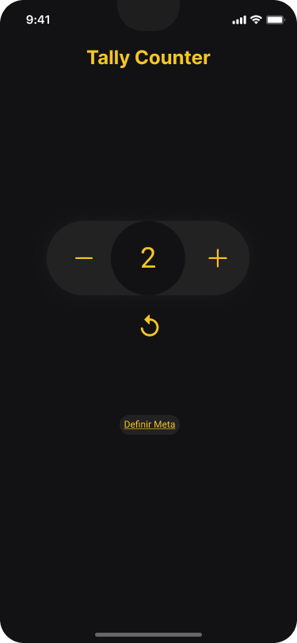
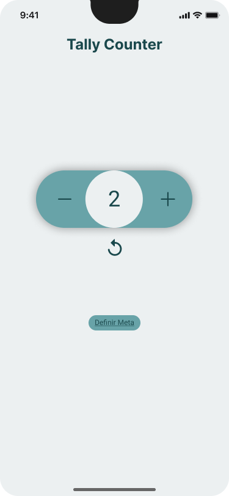

# Tally Counter App

---

  <b>✅ Concluído ✅</b>

  

    
    
    
    
    
  

---

## O Projeto
Tally Counter App consiste em um aplicativo de contagem simples e minimalista, apenas com as funções necessárias para que o usuário não fique perdido e consiga usar o aplicativo sem problemas.

Para usar o Tally Counter App em seu dispositivo mobile, você pode estar baixando o APK dele neste [link](https://expo.dev/artifacts/eas/sFw3HGhBxkxLKnn6esRtog.apk).

### Principais funcionalidades:

- O próprio contador: Você pode incrementar ou decrementar um número. Para isso você pode utilizar os botões (- | +) ou arrastar o círculo em que está o número para um dos lados.
- Resetar o número à zero, de volta ao seu estado inicial. Funciona da mesma forma que as funções incrementar e decrementar funcionam.
- Definir um limite para o incrementador, apertando o botão "Definir Meta".
- E o melhor... trocar a paleta de cores. Até o momento tem apenas duas: Dark e Light. As padrões de qualquer aplicação com essa funcionalidade.

#### ⚠️ Atenção ⚠️

Apesar deste aplicativo ser desenvolvido com o React Native, um framework multiplataforma, ele tem suporte apenas para android.

## 📱 Layout

  
  

### GIF

## 🧰 Tools

- [Expo](https://docs.expo.dev/)
- [React Native](https://reactnative.dev/)
- [Yarn](https://yarnpkg.com/)
- [Android Studio](https://developer.android.com/studio)
- [VS Code](https://code.visualstudio.com/)
- [Figma](https://www.figma.com/)

## 📜 Licença

Este projeto utiliza a [Licença MIT](./LICENSE.md).